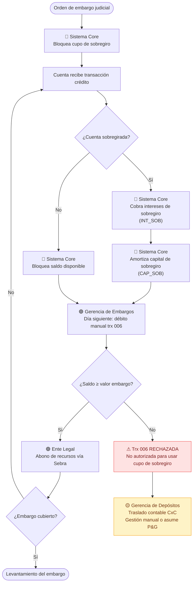

# Proceso As Is — Cuentas corrientes embargadas con sobregiro

## Descripción del problema

Cuando una cuenta corriente embargada recibe un crédito y tiene saldo de sobregiro pendiente, el sistema aplica primero los intereses (`INT_SOB`) y el capital (`CAP_SOB`) del sobregiro, agotando el saldo disponible. Al día siguiente, la Gerencia de Embargos ejecuta el débito manual con la transacción `006`, la cual **no tiene autorización para operar sobre el cupo de sobregiro**, generando su rechazo.

Esto incumple la prelación legal que establece que las obligaciones de embargo deben atenderse antes que cualquier cobro interno.

---

## Áreas participantes

| Área | Rol en el proceso |
|---|---|
| Ente legal | Emite la orden de embargo (DIAN, UGPP, Juzgados) |
| Sistema Core | Bloquea el cupo de sobregiro y aplica cobros automáticos |
| Gerencia de Embargos | Ejecuta el débito manual `006` al día siguiente |
| Gerencia de Depósitos | Asume el rechazo mediante traslado contable CxC |

---

## Diagrama del proceso actual

---

## Punto crítico de fallo

El problema ocurre en la **secuencia de aplicación de recursos** cuando la cuenta está sobregirada:

| Orden actual (incorrecta) | Orden correcta (según prelación legal) |
|---|---|
| 1. Intereses de sobregiro (`INT_SOB`) | 1. Embargo (`006`) |
| 2. Capital de sobregiro (`CAP_SOB`) | 2. Intereses de sobregiro (`INT_SOB`) |
| 3. Embargo (`006`) — **rechazado** | 3. Capital de sobregiro (`CAP_SOB`) |

---

## Riesgos identificados

- **Regulatorio:** Incumplimiento de órdenes judiciales y administrativas frente a entes como DIAN, UGPP y juzgados. Riesgo de sanciones de la Superfinanciera.
- **Financiero:** La Gerencia de Depósitos debe asumir el valor rechazado contra su P&G mediante traslado contable CxC.
- **Operativo:** El proceso de corrección es 100% manual y reactivo, sin trazabilidad automática.
- **Reputacional:** Incumplimiento reiterado puede deteriorar la relación con entes legales y reguladores.