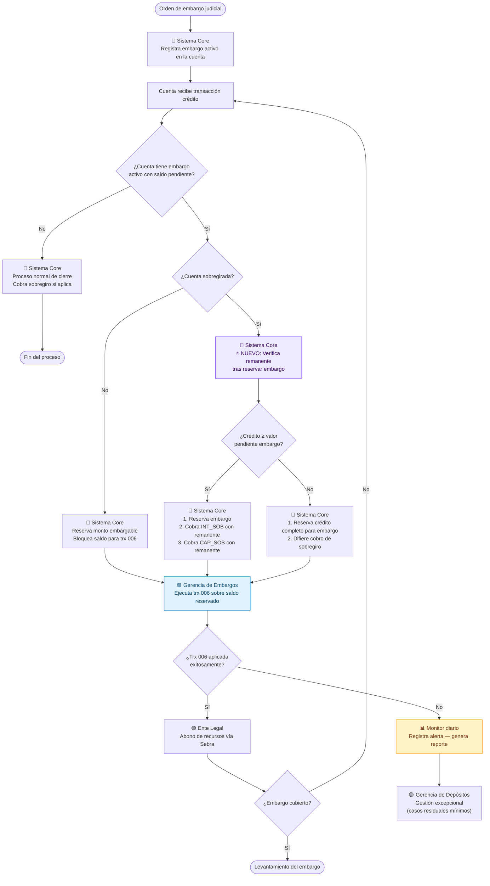
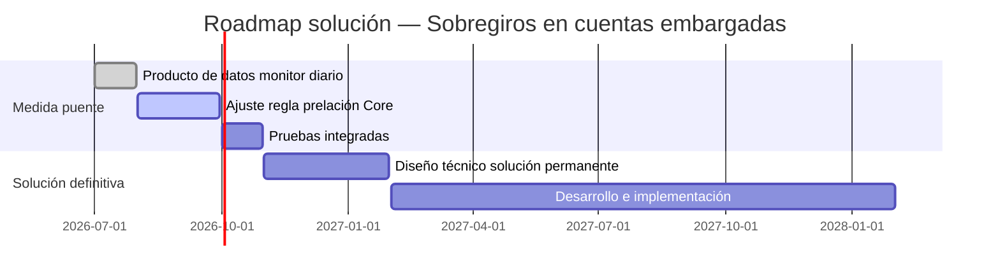

# Proceso To Be — Cuentas corrientes embargadas con sobregiro

## Descripción de la solución

Se propone implementar una **regla de prelación de recursos** en el proceso nocturno de cierre de depósitos. Antes de aplicar cualquier cobro de sobregiro, el sistema debe verificar si la cuenta tiene un embargo activo con saldo pendiente. Si existe, reserva primero el monto embargable y solo cobra el sobregiro sobre el remanente.

Como medida transitoria (antes de la solución definitiva en 3 años), se implementa adicionalmente un **producto de datos de monitoreo diario** que identifica proactivamente las cuentas en riesgo.

---

## Cambios respecto al proceso actual

| Aspecto | As Is (actual) | To Be (propuesto) |
|---|---|---|
| Secuencia de aplicación | Sobregiro → Embargo | Embargo → Sobregiro |
| Detección de rechazos | Reactiva (día siguiente) | Proactiva (mismo día) |
| Gestión | Manual por Gerencia de Depósitos | Automatizada por el sistema |
| Trazabilidad | Sin registro automático | Log diario de alertas |
| Riesgo regulatorio | Alto | Mitigado |

---

## Prelación de recursos propuesta

Cuando una cuenta corriente embargada y sobregirada recibe un crédito:

| Prioridad | Aplicación | Justificación |
|---|---|---|
| 1 | Embargo (`006`) | Obligación legal — prevalece sobre cualquier cobro interno |
| 2 | Intereses de sobregiro (`INT_SOB`) | Solo si hay remanente tras cubrir el embargo |
| 3 | Capital de sobregiro (`CAP_SOB`) | Solo si hay remanente adicional |

---

## Diagrama del proceso propuesto



---

## Componentes de la solución

### 1. Regla de prelación (cambio en Sistema Core)

Modificación en el proceso nocturno de cierre de depósitos para evaluar, antes de cualquier cobro de sobregiro, si la cuenta tiene embargo activo. Esta es la **solución estructural** y requiere desarrollo en el sistema Core con un horizonte de implementación de 4 meses como medida puente.

### 2. Monitor diario (producto de datos)

Script Python que se ejecuta cada día y genera un reporte con las cuentas en riesgo. Permite a la Gerencia de Embargos actuar de forma proactiva antes de ejecutar la `006`.

```
Entradas:   sobregiros.db (snapshot diario)
Proceso:    Clasificación ALERTA / NORMAL por cuenta
Salidas:    Reporte CSV con cuentas en riesgo del día
```

---

## Roadmap de implementación



---

## Riesgos residuales mitigados

| Riesgo | As Is | To Be |
|---|---|---|
| Incumplimiento regulatorio | Alto | Bajo — embargo siempre tiene prioridad |
| Pérdida financiera P&G | Recurrente | Excepcional — solo casos residuales |
| Gestión manual | 100% de rechazos | Solo casos no cubiertos por la regla |
| Trazabilidad | Nula | Automática vía monitor diario |